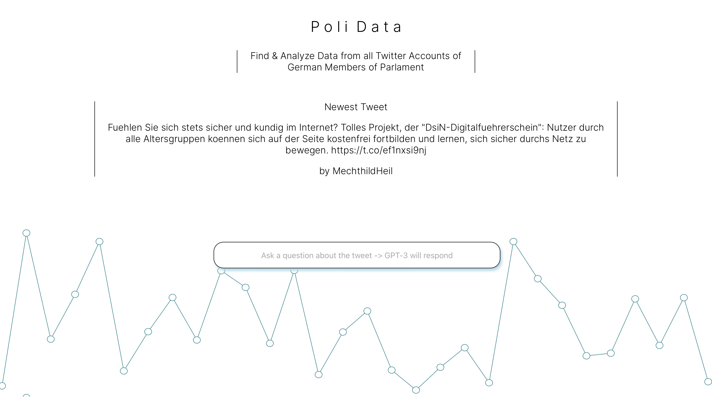

> Abstract: This blog post covers the implementation of a react web app implementing the Twitter API, creating a custom backend server by using a raspberry pi with Python and implementing the GPT-3 API to analyze the tweets.

## About




You'll find the implementation and documentation of my code below and the full version on [GitHub](https://www.github.com)


## The Idea

Originally, I tried some mashine learning based algorithms. Although I had some success, I wanted a simpler and somewhat more efficient solution for my problem. Instead of looking for patterns in the image itself shown by the puzzle, I wanted to create an algorithm that could find the matching pieces only based on the shape of the pieces.

Consequently, I started with scanning some of the puzzle pieces to get a small data set of the problem I actually wanted to solve:


The overarching goal was to create a brute force algorithm for the jigsaw puzzle. Hence, I needed to find solutions for the following problems:

1.Scanning the Images

2.Detecting the Edges

3.Matching the puzzle pieces

I will cover each step in detail in the following paragraphs. For development, I used Python. You can find the code in a Jupyter Notebook (.ipynb) at Github.

## Scanning the Images

First, I started to import some useful tools:

```py

from __future__ import print_function
import cv2
import matplotlib.pyplot as plt
import numpy as np
import argparse
import math
import collections 

```

I started off by scanning some images to start developing my algorithm:

```py

# Scanning two sample Images

path_og = r' - enter path here -'
path_match = r' - enter path here -'

images_count = 2

img = cv2.imread(path_og)
img_match = cv2.imread(path_match)

```

For example, one of the images I scanned looked like this:

```py

plt.imshow(img)

```

### [Enter Image Here]

I defined some useful functions to reduce the data generated by the image by reducing it to a black / white scheme:

```py

def thresholder(image):
    gray   = cv2.cvtColor(image, cv2.COLOR_BGR2GRAY)
    gray   = cv2.medianBlur(gray, ksize=5)
    thresh = cv2.threshold(gray, 190, 255, cv2.ADAPTIVE_THRESH_GAUSSIAN_C)[1]
    thresh = cv2.blur(thresh, ksize=(3, 3))
    return thresh

def tresher(img):
    thresh = thresholder(img)
    return thresh

thresh_original = tresher(img)
thresh_match = tresher(img_match)

plt.imshow(thresh_match,"binary_r")

```

### [Enter Image here]


```javascript

for(int i = 0; i < 10; i++){
    System.out.println(HelloWorld)
}

```

## Hier kommt die nächste Überschrift

Hallo