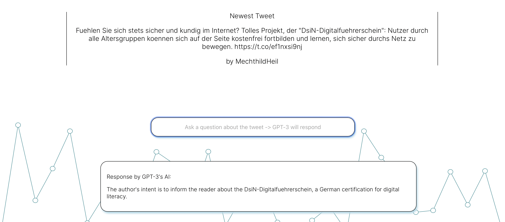

> Abstract: This blog post covers the implementation of a react web app implementing the Twitter API, creating a custom backend server by using a raspberry pi with Python and implementing the GPT-3 API to analyze the tweets.

## About


This is a personal project to better my understanding of react development, backend creation and AI integration.
The overarching goal is to create a dynamic website displaying the most recent tweet by German politicians which can then be analyzed using GPT-3's NLP AI by asking generic questions (e.g. "What is the author's intention?").


You'll find the full implementation and documentation of my code on [GitHub](https://www.github.com)


## Overview

The react web app is very self-explanatory and straight-forward: The first page displays the newest tweet that was posted by a German member of parlament in addition to their name.


This is realized by using the Twitter API. If a new tweet is posted, it's directly streamed to the Firebase Database. This is realized by using a python script running on a raspberry pi that checks for new tweets on a regular interval.

Here you can see an image of my raspberry pi:


The newest tweet is then shown to the user. By using the search bar on the front page, the user can ask questions about the tweets which are answered by Open AI's GPT-3. This was realized by implementing the GPT-3 API.

Here you can find some sample questions & answers:

Question:


Response:



In the following paragraphs I'll explain the ideas behind my code, so you can get a better understanding of the overall architecture of this application.

## Twitter API and Uploading to Firebase

Initially, I programmed a python script, that directly streams the newest data in a certain Twitter list.

In order to get access to the Twitter API, you have to use your private API keys. For obvious reasons I won't display the keys here.

```python

# Secret Keys for Twitter API

consumer_key = "<consumer_key>"
consumer_secret = "<consumer_secret>"
access_token = "<access_token>"
access_token_secret = "<access_token_secret>"

```
<br>

We then have to authenticate ourselves. I then created a list which contains all the members of the list in order to stream their newest tweets.

```python

# Creating the authentication object
auth = tweepy.OAuthHandler(consumer_key, consumer_secret)
# Setting your access token and secret
auth.set_access_token(access_token, access_token_secret)
# Creating the API object while passing in auth information
api = tweepy.API(auth)

#ListID of Bundestagsabgeordnete
list_id = 912241909002833921

# Creating List of Members

list_of_list_members = []

for member in api.get_list_members(list_id=list_id, count = 800):
   list_of_list_members.append(member.id_str)

auth = tweepy.OAuthHandler(consumer_key, consumer_secret)
auth.set_access_token(access_token, access_token_secret)
myStream = CustomStreamListener(consumer_key, consumer_secret, access_token, access_token_secret)
myStream.filter(follow = list_of_list_members, threaded = True)

```
<br>

As you can see, I've created a custom StreamListener. In this class I implemented the logic to upload our data to firebase.

If our StreamListener receives a new tweet, the on_status method from the parent class is called. We override this method an implement our logic:

```python
def on_status(self, status):
        if self.from_creator(status=status):
            Created = status.created_at.strftime("%Y-%m-%d-%H:%M:%S")

            # Handling 140 words vs. 280 words in Tweets

            if status.extended_tweet['full_text'] is not None:
                Text = self.normalize_german(status.extended_tweet['full_text'])
            else:
                Text = self.normalize_german(status.text)

            print(Text)
            Follower = str(status.user.followers_count)
            Name = status.user.screen_name
            Friends = str(status.user.friends_count)
            FirebaseUpload.upload(Created=Created, Text=Text, Follower=Follower, Name=Name, Friends=Friends)
        else:
            pass
```
<br>

normalize_german() is a method that converts german "Umlaute" (like "ä", "ö", ...) to a better representation (like "ae" instead of "ä"). We also have do differenciate between short tweets (140 words) and long tweets (280 words) as the default attribute "text" only shows the first 140 words.

We then upload various data to Firebase which we can then use to process later.

## Creating a react web application

There are various ways to create a react web application by using different frameworks (e.g. Gatsby). In this case I've decided to go for a default react application.


Originally, I designed the design of the website in Figma and then converted it to html, css and JavaScript.

## Accessing the GPT-3 API

You first have to register for the API Access to get a API key. This key can then be used to access the GPT-3 API:

```js

const { Configuration, OpenAIApi } = require("openai");
const configuration = new Configuration({
  apiKey: "<add API key here>",
});
const openai = new OpenAIApi(configuration);
function oToString(o){
  return "Text: " + o.Text.toString() + ", Written_By: " + o.Written_By.toString() + ", NumberOfFollowers: " + o.NumberOfFollowers.toString() + ", Friends: " + o.Friends.toString() + ", Created: " + o.Created.toString}
export function getResponse(input, data){
  const response = openai.createAnswer({
    search_model: "ada",
    model: "curie",
    question: input.toString(),
    documents: [oToString(data)],
    examples_context: oToString({Text: "Auf das weniger „erfolgsverwoehnte“ Sachsen trifft das ebenfalls zu … 🥲 https://t.co/e9j86Fq2Tv", Written_By: "BHerrmann_", NumberOfFollowers: "1487", Friends: "1381", Created: "2022-04-18-13:05:14"}),
    examples: [
      ["Who wrote 'Auf das weniger „erfolgsverwoehnte“ Sachsen trifft das ebenfalls zu … 🥲'","BHerrmann_"],
      ["When was the tweet written?", "2022-04-18-13:05:14"]
    ],
    max_tokens: 50,
    stop: ["\n", "<|endoftext|>"],
  });
  return response
}

```
<br>

We provide the AI model with some sample tweets and some formated data, which we pass from our Firebase Backend. This is realized by the method onSubmit() which listens for a text submit from the search bar on the front page:

```js

async function onSubmit(event) {
    event.preventDefault();
    // Getting Response from GPT-3
    getResponse(searchInput, sampleTweet)
    .then( (val) => SetText(val.data.answers[0]));
    // Logging
    //console.log(sampleTweet);
    displayResponse(true);
    setSearchInput("");
  }

```

## Summary

This was a very brief overview of the project architecture. Please check out the project on [GitHub](https://www.github.com) to get a better overview of the overall structure.


